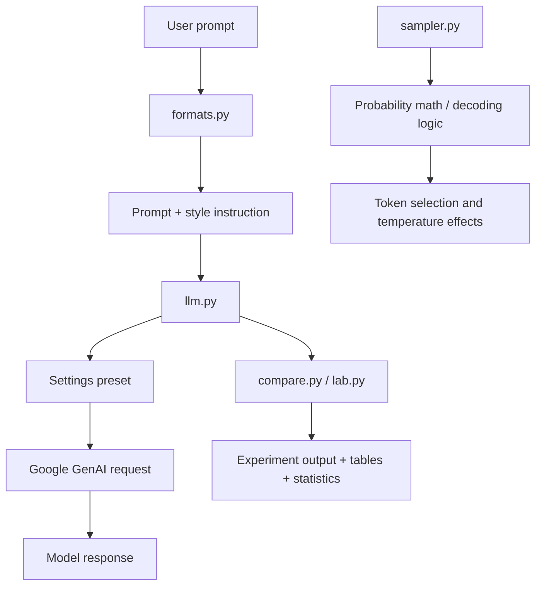

# Logits, Temperature & Response Formatting

This utility was built to explore how generation settings change model behavior, especially the effect of temperature, top-p / top-k truncation, and response-shaping instructions on the final text output.

It is a small lab for experimenting with LLM decoding behavior and comparing different presets side by side.


## What this project demonstrates

This project is a compact LLM behavior lab. It helps answer a few practical questions:

- How does temperature affect sampling randomness?
- How do top-k and top-p filtering change the candidate pool?
- How do prompt-format instructions shape the final response?
- How do different presets behave on the same model and prompt?

The code is intentionally lightweight and easy to inspect, which makes it useful for learning and for quick experiments.

---

## Architecture at a glance

The project is organized as a simple pipeline:



At a high level:

- `formats.py` wraps a question with output-format instructions.
- `settings.py` defines the generation presets used in experiments.
- `llm.py` converts those settings into Gemini request configuration.
- `sampler.py` contains the core token-sampling logic and math.
- `compare.py` runs repeated model calls and compares behavior across presets.
- `lab.py` demonstrates the same behavior with toy logits in a simple console script.

---

## File-by-file overview

### `settings.py`

This file defines the application settings model.

Key pieces:

- `Settings`: a dataclass for generation parameters
- `temperature`, `top_p`, `top_k`, `seed`, `max_output_tokens`, `stop_sequences`
- `tweak(...)`: creates a modified preset without mutating the original
- `PRESETS`: named presets such as:
  - `precise` → very deterministic
  - `balanced` → middle ground
  - `wild` → higher creativity / randomness
  - `seeded` → same as balanced but seeded

This is the configuration layer that makes experimentation consistent and reusable.

### `sampler.py`

This module implements the probabilistic logic used when choosing a token.

Functions:

- `softmax(logits, temperature=1.0)`
  - Converts model logits into a probability distribution
  - Temperature controls how sharp or smooth the distribution becomes

- `greedy_index(logits)`
  - Picks the highest logit, equivalent to greedy decoding

- `top_k_filter(probs, k)`
  - Keeps only the highest-probability tokens

- `top_p_filter(probs, p)`
  - Keeps a cumulative probability mass threshold

- `pick_token(...)`
  - Combines softmax, temperature scaling, and top-k/top-p filtering into a single sampling step

This is the mathematical core behind decoding behavior, independent of the external model API.

### `formats.py`

This module adds response schema instructions to the raw user question.

Example styles:

- `one_line`
- `bullets`
- `json`

The `shape(question, style)` function appends a strict format instruction to the prompt so the model is guided toward a specific response format.

This is useful when you want to compare not only the model’s choice but also the formatting discipline under different settings.

### `llm.py`

This file is the API integration layer for Google Gemini.

It does the following:

- loads `.env` values
- reads `GEMINI_API_KEY`
- creates a `google.genai.Client`
- maps each preset to supported model parameters
- filters unsupported settings for a given model
- sends requests with `generate_content(...)`
- captures usage metadata and finish reasons

Important concepts:

- `MODELS` defines model IDs and supported options
- `build_config(...)` removes unsupported properties rather than crashing
- `ask(...)` wraps the actual call and returns a `Result` object with:
  - `text`
  - `finish`
  - `input_tokens`
  - `output_tokens`
  - `thought_tokens`
  - `seconds`
  - `dropped`

This module acts as the bridge between the experiment logic and the actual model provider.

### `compare.py`

This is the experiment runner.

It:

- parses command-line arguments
- loops over presets (`precise`, `balanced`, `wild`, etc.)
- calls the model multiple times
- captures result text, finish reasons, and token usage
- summarizes statistics in a Rich table
- reports how many unique responses were seen across runs
- compares variance between conservative and wild settings

The `verdict(...)` function explains whether the stochastic effect is visible or whether the prompt might be too constrained to show a meaningful difference.

This is the main utility for evaluating whether temperature actually changes output patterns in practice.

### `lab.py`

This file is a didactic demonstration script.

It uses a toy set of logits and prints:

- probability distributions at different temperatures
- the effect of top-p filtering
- repeated random draws from a simple token distribution

This makes it easy to understand the underlying behavior without needing a live model call for every experiment.

---

## Typical workflow

### 1. Explore the toy sampling math

```bash
python lab.py
```

This should print a small set of sanity checks showing how probabilities shift as temperature changes.

### 2. Compare real model behavior across presets

```bash
python compare.py "Give me one name for a coffee shop run by robots. Only the name." --model gemma --runs 5 --presets precise,balanced,wild
```

This runs the same prompt repeatedly using different generation presets and shows a table of outputs and statistics.

### 3. Force unsupported settings through a model

```bash
python compare.py "Write a haiku about rain." --model gemma --force
```

The `--force` option allows atypical options to be sent even when the model does not officially advertise support for them. The code tracks which settings were dropped and prints them afterward.

---

## Why this project matters

This folder is a compact demonstration of how LLM decoding works in practice:

- temperature changes entropy
- top-k and top-p shape candidate pools
- formatting instructions affect the final answer structure
- repeated runs reveal whether the model is actually varying its output or just producing the same completion

The code is intentionally simple, which makes it easy to inspect and modify. It is a good starting point for experiments, debugging generation behavior, and understanding how prompt constraints interact with model sampling.

---

## Dependencies

The project depends on the Gemini Python SDK and the Rich terminal library:

- `google-genai`
- `rich`
- `python-dotenv`

See `requirements.txt` for the exact package list.

---

## Summary

This utility is best understood as a small LLM behavior lab:

- `sampler.py` explains the sampling math
- `settings.py` defines the generation presets
- `llm.py` passes those settings into the live model API
- `formats.py` controls the response structure
- `compare.py` measures how settings affect real output
- `lab.py` makes the underlying math visible in a toy example

The project was built to make LLM generation behavior easier to inspect, reason about, and compare across different temperature and decoding settings.
